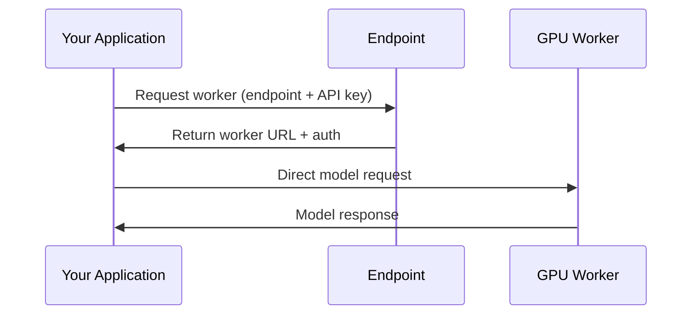

## Prerequisites

Before you begin, make sure you have:

<CardGroup cols={2}>
  <Card title="Vast.ai Account" icon="user">
    Sign up at [cloud.vast.ai](https://cloud.vast.ai) and add credits to your account
  </Card>
  <Card title="API Key" icon="key">
    Generate an API key from your [account settings](https://docs.vast.ai/keys). For models requiring authentication tokens, see [environment setup](/serverless/environment-setup).
  </Card>
</CardGroup>

### Install the Vast CLI

```bash
pip install vastai
vastai set api-key YOUR_API_KEY
```

Replace `YOUR_API_KEY` with your actual API key from the account settings.

## Deploy Your First Endpoint

<Steps>
  <Step title="Create an Endpoint">
    <Tabs>
      <Tab title="Web UI">
        Navigate to the [Serverless Dashboard](https://cloud.vast.ai/serverless/) and click **"Create Endpoint"**.
        
        Use these recommended settings for your first deployment:
        
        | Setting | Value | Description |
        |---------|-------|-------------|
        | **Cold Multiplier** | 3 | Scales capacity based on predicted load |
        | **Cold Workers** | 5 | Pre-loaded instances for instant scaling |
        | **Max Workers** | 16 | Maximum GPU instances |
        | **Minimum Load** | 100 | Baseline tokens/second capacity |
        | **Target Utilization** | 0.9 | Resource usage target (90%) |
        | **Endpoint Name** | vLLM-Qwen3-8B | Name for your endpoint |
        
        
        
        Click **"Create"** to proceed.
      </Tab>
      
      <Tab title="Vast CLI">
        Run the following command to create your endpoint:
        
        ```bash
        vastai create endpoint \
          --endpoint_name "vLLM-Qwen3-8B" \
          --cold_mult 3.0 \
          --cold_workers 5 \
          --max_workers 16 \
          --min_load 100 \
          --target_util 0.9
        ```
        
        A successful creation will return `'success': True` in the terminal.
      </Tab>
    </Tabs>
  </Step>

  <Step title="Create a Workergroup">
    <Tabs>
      <Tab title="Web UI">
        From the Serverless page, click **"+ Workergroup"** under your endpoint.
        
        Select the **vLLM (Serverless)** template, which comes pre-configured with:
        - **Model**: Qwen/Qwen3-8B (8 billion parameter LLM)
        - **Framework**: vLLM for high-performance inference
        - **API**: OpenAI-compatible endpoints
        
        <Note>
          Some models (like Llama, Mistral, or private models) require a HuggingFace token for access. See the [environment setup guide](/serverless/environment-setup#environment-variables) for configuration.
        </Note>
        
        Configure your GPU requirements:
        - **Recommended**: RTX 4090 or RTX 4000 series
        - **Memory**: At least 24GB VRAM for Qwen3-8B
        - **Filter**: Enable "Secure Cloud" for datacenter-grade reliability
        
        
        
        Click **"Create"** to proceed.
      </Tab>
      
      <Tab title="Vast CLI">
        To get the template hash:
        1. Navigate to the [Templates Page](https://cloud.vast.ai/templates/)
        2. Select the Serverless filter
        3. Find "vLLM + Qwen/Qwen3-8B (Serverless)" template
        4. Click "More Options" and select "Copy template hash"
        
        Then create the workergroup:
        
        ```bash
        vastai create autogroup \
          --endpoint_name "vLLM-Qwen3-8B" \
          --template_hash "YOUR_TEMPLATE_HASH" \
          --test_workers 5
        ```
        
        To specify GPU requirements, add a search parameter:
        ```bash
        vastai create autogroup \
          --endpoint_name "vLLM-Qwen3-8B" \
          --template_hash "YOUR_TEMPLATE_HASH" \
          --test_workers 5 \
          --search_params "gpu_name=RTX_4090 gpu_ram>=24"
        ```
        
        The `test_workers` parameter creates initial workers for benchmarking and keeps them ready as cold workers.
      </Tab>
    </Tabs>
  </Step>

  <Step title="Wait for Workers to Initialize">
    <Tabs>
      <Tab title="Web UI">
        Your serverless infrastructure is now being provisioned. Workers will automatically download the model and complete initialization. 
        
        Monitor the worker status in the dashboard:
        - **Inactive**: Worker is initializing or stopped
        - **Ready**: Worker is available to handle requests
        
        You can view detailed statistics by clicking **"View detailed stats"** on the Workergroup.
        
        
      </Tab>
      
      <Tab title="Vast CLI">
        Check the status of your workers:
        
        ```bash
        # View all instances
        vastai show instances
        
        # View autogroups for your endpoint
        vastai show autogroups
        ```
        
        Workers need to reach "Ready" status before they can handle requests.
      </Tab>
    </Tabs>
  </Step>
</Steps>

## Understanding the Architecture

Your serverless deployment consists of three key components:

<CardGroup cols={3}>
  <Card title="Endpoint" icon="route">
    Assigns incoming requests to available workers and handles authentication
  </Card>
  <Card title="GPU Workers" icon="microchip">
    Run your model and process requests. Scale automatically based on demand
  </Card>
  <Card title="Your Application" icon="code">
    Sends requests through the routing service to reach workers
  </Card>
</CardGroup>

### Request Flow



## Make Your First API Call

Let's understand how to call your serverless endpoint step by step:

### Step 1: Download SSL Certificate

Download Vast's root certificate to enable secure connections:

```bash
curl -O https://console.vast.ai/static/jvastai_root.cer
```

### Step 2: Install Dependencies

Install the required Python packages:

```bash
pip install requests
```

### Step 3: Get Your API Credentials

Once your first worker shows **"Ready"** status, retrieve your endpoint credentials:

```bash
vastai show endpoints
```

You'll receive a response like this:

```json
{
  "endpoint_name": "Endpoint-abc123",
  "api_key": "xxxxxxxxxxxxxxxxxxxxxxxxxxxxxxxxxxxxxxxxxxxxxxxxxxxxxxxxxxxxxxxx",
  "endpoint_state": "active",
  "id": 1234
}
```

<Warning>
  Keep your API key secure. It provides full access to your endpoint.
</Warning>

### Step 4: Set Up Your Credentials

Now configure these credentials in your Python script:

```python
# Replace these with your actual values from 'vastai show endpoints'
ENDPOINT_NAME = "Endpoint-abc123"  
API_KEY = "your-api-key-here"
```

### Step 5: Request a Worker Assignment

The routing service assigns you an available GPU worker:

```python
# Request a worker from the routing service
route_response = requests.post(
    "https://run.vast.ai/route/",
    json={
        "endpoint": ENDPOINT_NAME,
        "api_key": API_KEY,
        "cost": 256  # Estimated tokens for this request
    }
)

route = route_response.json()
print(f"Route response: {route}")

# Extract the worker URL - the response format may vary
worker_url = route.get('url') or route.get('worker_url') or route.get('worker', {}).get('url')
if not worker_url:
    print(f"Could not find worker URL in response: {route}")
    exit(1)

print(f"Assigned worker: {worker_url}")
```

### Step 6: Call the Model

Now send your prompt directly to the assigned worker:

```python
# Prepare your prompt
messages = [
    {"role": "user", "content": "Explain quantum computing in simple terms"}
]

# Call the model on the assigned worker
model_response = requests.post(
    f"{route['url']}/v1/chat/completions",
    json={
        "auth_data": route,  # Include routing credentials
        "payload": {
            "input": {
                "model": "Qwen/Qwen3-8B",
                "messages": messages,
                "temperature": 0.7,
                "max_tokens": 200
            }
        }
    },
    verify='/path/to/jvastai_root.cer'  # Path to downloaded certificate
)

# Extract the response
result = model_response.json()
answer = result["choices"][0]["message"]["content"]
print(f"Model response: {answer}")
```


## Complete Example

Here's the full Python script combining all the steps:

```python
import requests
import json

# Configuration
ENDPOINT_NAME = "vLLM-Qwen3-8B"  # Replace with your endpoint name
API_KEY = "your-api-key-here"    # Replace with your API key
CERT_PATH = "/path/to/jvastai_root.cer"  # Path to downloaded certificate

# Step 1: Request a worker from the endpoint
route_response = requests.post(
    "https://run.vast.ai/route/",
    json={
        "endpoint": ENDPOINT_NAME,
        "api_key": API_KEY,
        "cost": 256  # Estimated tokens for this request
    }
)

if route_response.status_code != 200:
    print(f"Error getting worker: {route_response.text}")
    exit(1)

route = route_response.json()
print(f"Route response: {route}")

# Extract the worker URL - the response format may vary
worker_url = route.get('url') or route.get('worker_url') or route.get('worker', {}).get('url')
if not worker_url:
    print(f"Could not find worker URL in response: {route}")
    exit(1)

print(f"Assigned worker: {worker_url}")

# Step 2: Call the model on the assigned worker
messages = [
    {"role": "user", "content": "Explain quantum computing in simple terms"}
]

model_response = requests.post(
    f"{worker_url}/v1/chat/completions",
    json={
        "auth_data": route,  # Include routing credentials
        "payload": {
            "input": {
                "model": "Qwen/Qwen3-8B",
                "messages": messages,
                "temperature": 0.7,
                "max_tokens": 200
            }
        }
    },
    verify=CERT_PATH  # Path to downloaded certificate
)

if model_response.status_code != 200:
    print(f"Error calling model: {model_response.text}")
    exit(1)

# Step 3: Extract and display the response
result = model_response.json()
answer = result["choices"][0]["message"]["content"]
print(f"\nModel response:\n{answer}")
```

## Troubleshooting

<AccordionGroup>
  <Accordion title="Workers stuck in 'Loading' state">
    - Check if the GPU has enough VRAM for your model
    - Verify your model name is correct
    - Check worker logs: `vastai logs INSTANCE_ID`
  </Accordion>
  <Accordion title="'No workers available' error">
    - Wait 30-60 seconds for workers to initialize
    - Check endpoint status: `vastai show endpoints`
    - Verify you have active workers in the dashboard
  </Accordion>
  <Accordion title="SSL certificate warnings">
    - This is expected with self-signed certificates
    - For development: Use `verify=False` in requests
    - For production: Install Vast's root certificate
  </Accordion>
  <Accordion title="Slow response times">
    - First request to a cold worker takes longer
    - Increase `cold_workers` for better availability
    - Check if workers are in the same region as your users
  </Accordion>
</AccordionGroup>

---

<Note>
  **Need help?** Join our [Discord community](https://discord.gg/hSuEbSQ4X8) or check the [detailed documentation](/serverless/architecture) for advanced configurations.
</Note>